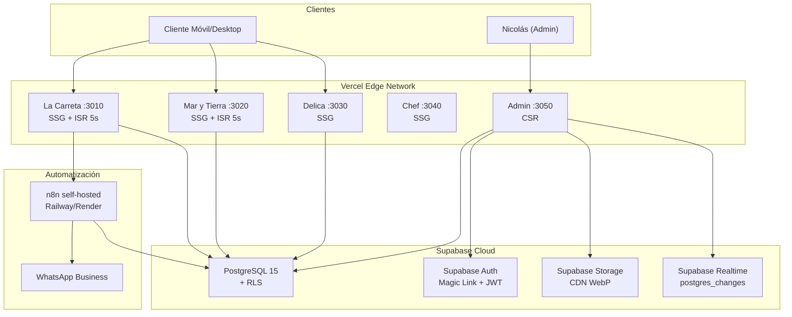

# Sistema de Operación Digital — Nicolás Suárez · Documentación Técnica

**Versión**: 0.1.0  
**Stack**: Next.js 16 · TypeScript 5.9 · Supabase · Tailwind CSS 4 · Turborepo  
**Última actualización**: 2026-05-19

---

## Tabla de Contenidos

1. [Visión General del Proyecto](#1-visión-general-del-proyecto)
2. [Arquitectura General](#2-arquitectura-general)
3. [Stack Tecnológico](#3-stack-tecnológico)
4. [Estructura del Proyecto](#4-estructura-del-proyecto)
5. [Esquema de Base de Datos](#5-esquema-de-base-de-datos)

> Las secciones 6–14 se encuentran en `DOCUMENTATION_02_apis.md` y `DOCUMENTATION_03_ops.md`.

---

## 1. Visión General del Proyecto

### Propósito
Plataforma digital unificada para la gestión de **3 restaurantes** en Zipaquirá, Cundinamarca, Colombia. Diseñada para operar de forma autónoma mientras el propietario (Nicolás Suárez — Chef Ejecutivo y Gerente General) está en cocina.

### Problema que Resuelve
- **Clientes locales**: necesitan ver menús actualizados con precios/fotos y reservar mesa en menos de 30 segundos.
- **Turistas**: necesitan encontrar el restaurante en Google y decidir en menos de 10 segundos.
- **Nicolás (admin)**: necesita desactivar platos agotados desde el celular en menos de 20 segundos y ver reservas de los 3 restaurantes en una sola vista.

### Usuarios Objetivo

| Usuario | Acceso | Necesidad |
|---|---|---|
| Nicolás (admin) | Panel admin — JWT Magic Link | Actualizar menú, ver reservas unificadas |
| Cliente local | Sitio público | Menú + reserva rápida + confirmación WhatsApp |
| Turista | Sitio público (SEO) | Google Maps → decidir en <10s |
| Cliente Delica | delicazipa.co | Storytelling de cata, justificar precio premium |

### Estado Actual
**Producción activa** — Las 5 aplicaciones están desplegadas en Vercel con CI/CD funcional. El panel admin opera con autenticación real via Supabase Auth. Los menús digitales sirven datos reales desde PostgreSQL con ISR de 5 segundos. Las notificaciones en tiempo real (Supabase Realtime) están implementadas en el dashboard de reservas.

---

## 2. Arquitectura General

### Diagrama de Alto Nivel



### Patrón Arquitectural
**Monorepo Multi-Tenant** con renderizado híbrido. Un repositorio Git contiene 5 aplicaciones Next.js, cada una desplegada como proyecto Vercel independiente, compartiendo paquetes comunes.

**Modelo**: `thin server, fat edge` — lógica de negocio en API Routes de Next.js + Supabase; contenido cacheado en Vercel Edge.

### Flujo de Datos Principal

```
Cliente → Sitio Público (SSG/ISR) → API Route → Supabase PostgreSQL
                                         ↓
                                    n8n Webhook → WhatsApp (confirmación)
                                         ↓
                                    Callback → API Webhook → Supabase (status update)
```

---

## 3. Stack Tecnológico

| Capa | Tecnología | Versión | Propósito |
|---|---|---|---|
| Frontend | Next.js (App Router) | 16.2.0 | UI pública + panel admin, SSR/SSG/CSR |
| Lenguaje | TypeScript | 5.9.2 | Tipado estricto, zero `any` |
| Estilos | Tailwind CSS | 4.1.5 | Utilidades CSS, diseño responsivo |
| UI Runtime | React | 19.2.0 | Componentes, Server Components |
| BD | Supabase (PostgreSQL) | Cloud | Datos relacionales + RLS multi-tenant |
| Auth | Supabase Auth | SSR SDK 0.6.1 | Magic Link + password, JWT httpOnly |
| Storage | Supabase Storage | Cloud | Imágenes WebP < 200KB, CDN automático |
| Realtime | Supabase Realtime | Cloud | `postgres_changes` para notificaciones admin |
| Monorepo | Turborepo | 2.9.8 | Builds paralelos, cache, task orchestration |
| Paquetes | npm workspaces | 10.9.2 | Resolución de dependencias compartidas |
| Automatización | n8n | Self-hosted | WhatsApp confirmaciones via webhook |
| Iconos | Lucide React | 1.14.0 | Iconos SVG consistentes |
| E2E Testing | Playwright | 1.49.1 | Tests multi-app, multi-navegador |
| Performance | Lighthouse | 12.3.0 | Auditoría Core Web Vitals |
| Linting | ESLint | 9.39.1 | Calidad de código |
| Formatting | Prettier | 3.7.4 | Formato consistente |
| CI/CD | GitHub Actions | — | Lint → Type-check → Build → E2E → Deploy |
| Deploy | Vercel | — | Edge Network, ISR, Preview deploys |

---

## 4. Estructura del Proyecto

```
nicolas-suarez-ops/
├── .github/workflows/
│   └── ci.yml                    # Pipeline CI: lint → build → e2e → deploy
├── apps/
│   ├── la-carreta/               # Restaurante tradicional colombiano ($$)
│   │   ├── src/
│   │   │   ├── app/
│   │   │   │   ├── api/
│   │   │   │   │   ├── analytics/events/route.ts   # POST eventos analíticos
│   │   │   │   │   ├── reservations/route.ts        # POST crear reserva + rate limit
│   │   │   │   │   ├── revalidate/route.ts          # POST ISR on-demand
│   │   │   │   │   └── webhooks/n8n/route.ts        # POST callback n8n + HMAC
│   │   │   │   ├── menu/page.tsx                    # Menú digital (ISR 5s)
│   │   │   │   ├── reservas/page.tsx                # Formulario de reserva (CSR)
│   │   │   │   ├── page.tsx                         # Homepage (SSG)
│   │   │   │   ├── layout.tsx                       # Layout raíz + fonts + analytics
│   │   │   │   ├── robots.ts                        # robots.txt dinámico
│   │   │   │   └── sitemap.ts                       # sitemap.xml dinámico
│   │   │   ├── components/
│   │   │   │   ├── MenuCategoryFilter.tsx           # Filtro por categorías tipo fichas
│   │   │   │   ├── MenuContent.tsx                  # Grid de platos + scroll-spy
│   │   │   │   └── MenuItemSheet.tsx                # Sheet de detalle de plato
│   │   │   ├── hooks/                               # (vacío — .gitkeep)
│   │   │   └── lib/                                 # (vacío — .gitkeep)
│   │   ├── public/images/                           # Imágenes WebP optimizadas
│   │   ├── next.config.ts                           # transpilePackages + remotePatterns
│   │   └── package.json                             # web-la-carreta
│   ├── mar-y-tierra/             # Restaurante diferenciado ($$)
│   │   └── src/                                     # Misma estructura que la-carreta
│   │       ├── app/                                 # + store/ para estado local
│   │       ├── components/                          # MenuHero, CartWidget, CheckoutSheet
│   │       ├── hooks/
│   │       ├── lib/menu-data.ts                     # Datos estáticos del menú
│   │       └── store/                               # Estado local del carrito
│   ├── delica/                   # Restaurante premium, catas ($$$)
│   │   └── src/                                     # Misma estructura base
│   ├── chef/                     # Perfil profesional de Nicolás
│   │   └── src/                                     # Misma estructura base
│   ├── admin/                    # Panel de administración centralizado
│   │   └── src/
│   │       ├── middleware.ts                         # Protección de rutas + refresh JWT
│   │       ├── app/
│   │       │   ├── api/
│   │       │   │   ├── menu/items/[id]/route.ts     # PATCH toggle disponibilidad
│   │       │   │   ├── reservations/[id]/route.ts   # PATCH confirmar/cancelar
│   │       │   │   ├── experiences/route.ts          # CRUD experiencias Delica
│   │       │   │   └── revalidate/route.ts           # ISR on-demand
│   │       │   ├── auth/callback/route.ts            # OAuth code exchange
│   │       │   ├── auth/logout/route.ts              # Cerrar sesión
│   │       │   ├── login/page.tsx                    # Login Magic Link + password
│   │       │   ├── unauthorized/page.tsx             # Página 403
│   │       │   └── dashboard/
│   │       │       ├── layout.tsx                    # Sidebar + Topbar + BottomNav
│   │       │       ├── NotificationBell.tsx          # Notificaciones Realtime
│   │       │       ├── reservas/                     # Vista unificada 3 restaurantes
│   │       │       ├── menu/                         # CRUD + toggle disponibilidad
│   │       │       ├── analytics/                    # Dashboard analítico
│   │       │       └── contenido/                    # Editor Delica (catas)
│   │       └── utils/supabase/
│   │           ├── client.ts                         # Browser Supabase client
│   │           └── middleware.ts                     # Cookie-based session mgmt
│   ├── docs/                     # App Docusaurus (placeholder)
│   └── web/                      # App base Turborepo (placeholder)
├── packages/
│   ├── database/                 # @repo/database — Capa de datos
│   │   └── src/
│   │       ├── client.ts                            # Browser + Service role clients
│   │       ├── server.ts                            # Server SSR client (httpOnly cookies)
│   │       ├── env.ts                               # Validación de env vars
│   │       ├── types.ts                             # 7 tablas tipadas + Database schema
│   │       ├── schema.sql                           # DDL completo + RLS + seeds
│   │       ├── index.ts                             # Barrel export público
│   │       ├── config/featureFlags.ts               # Vercel Edge Config flags
│   │       ├── helpers/
│   │       │   ├── rls.ts                           # UUID validation + tenant access
│   │       │   └── index.ts                         # Barrel export helpers
│   │       ├── queries/
│   │       │   ├── admin.ts                         # Queries autenticadas (dashboard)
│   │       │   ├── menu.ts                          # getMenuByRestaurant, toggleMenuItem
│   │       │   ├── reservations.ts                  # createReservation, getReservations
│   │       │   └── experiences.ts                   # getPublishedExperiences
│   │       └── services/
│   │           └── notifications.ts                 # HMAC validation + WhatsApp builder
│   ├── ui/                       # @repo/ui — Design System compartido
│   │   └── src/
│   │       ├── index.ts                             # Barrel: 18 exports
│   │       ├── button.tsx                           # Multi-brand Button
│   │       ├── navbar.tsx                           # NavBar responsiva
│   │       ├── hero-section.tsx                     # Hero Section con overlay
│   │       ├── menu-card.tsx                        # Tarjeta de plato
│   │       ├── reservation-form.tsx                 # Formulario de reserva
│   │       ├── footer.tsx                           # Footer multi-restaurante
│   │       ├── bottom-nav.tsx                       # Navegación móvil inferior
│   │       ├── image-uploader.tsx                   # Upload + compresión WebP
│   │       ├── analytics-widget.tsx                 # Widget dashboard
│   │       ├── cata-card.tsx                        # Tarjeta experiencia (Delica)
│   │       ├── scroll-reveal.tsx                    # Animación scroll intersection
│   │       ├── custom-image.tsx                     # Image wrapper + validación
│   │       ├── input.tsx / badge.tsx / card.tsx      # Primitivos UI
│   │       ├── tokens.css                           # Design tokens CSS
│   │       ├── components/
│   │       │   ├── LoyaltyTracker.tsx               # Componente fidelización
│   │       │   └── section-header.tsx               # Header reutilizable
│   │       └── hooks/
│   │           ├── useAnalytics.ts                  # Hook tracking GA4 custom
│   │           └── useLoyalty.ts                    # Hook fidelización pasiva SHA-256
│   ├── eslint-config/            # @repo/eslint-config
│   └── typescript-config/        # @repo/typescript-config
├── infrastructure/
│   ├── supabase/migrations/                        # SQL migrations incrementales
│   │   ├── 20250514_000012_expand_menu_categories.sql
│   │   ├── 20250514_000013_seed_mar_y_tierra_menu.sql
│   │   └── 20250514_000014_delivery_orders.sql
│   ├── n8n/workflows/
│   │   ├── reserva-confirmacion.json               # Workflow WhatsApp cliente
│   │   └── alerta-admin.json                       # Workflow alerta a Nicolás
│   └── monitoring/
│       └── uptime-config.md                        # Config UptimeRobot
├── e2e/
│   ├── reservas.spec.ts                            # Flujo reserva completo (3 apps)
│   ├── admin-menu.spec.ts                          # Toggle menú admin
│   ├── auth.spec.ts                                # Login/logout admin
│   └── security.spec.ts                            # Rate limit + HMAC + RLS
├── docs/
│   ├── contingencia-rsk-002.md                     # Runbook: fallback n8n → Twilio
│   ├── env-production.md                           # Guía variables producción
│   └── launch-checklist.md                         # Checklist pre-lanzamiento
├── scripts/                                        # Scripts de utilidad
├── optimize.js                                     # Sharp: compresión imágenes → WebP
├── playwright.config.ts                            # Config E2E multi-app
├── turbo.json                                      # Turborepo task pipeline
└── package.json                                    # Root monorepo
```

---

## 5. Esquema de Base de Datos

> Fuente: [schema.sql](../packages/database/src/schema.sql)

### 5.1 Diagrama Entidad-Relación

```mermaid
erDiagram
    restaurants ||--o{ menu_items : "tiene"
    restaurants ||--o{ reservations : "recibe"
    restaurants ||--o{ experiences : "ofrece"
    restaurants ||--o{ loyal_visits : "trackea"
    restaurants ||--o{ analytics_events : "registra"
    auth_users ||--|| admin_users : "extiende"

    restaurants {
        uuid id PK
        text name
        text slug UK
        text domain UK
        jsonb theme_config
        boolean is_active
        timestamptz created_at
        timestamptz updated_at
    }

    menu_items {
        uuid id PK
        uuid restaurant_id FK
        text name
        text description
        numeric price
        text photo_url
        text category
        boolean is_available
        integer sort_order
        timestamptz created_at
        timestamptz updated_at
    }

    reservations {
        uuid id PK
        uuid restaurant_id FK
        text client_name
        text whatsapp
        date date
        time time
        smallint guests
        text status
        text notes
        timestamptz created_at
    }

    experiences {
        uuid id PK
        uuid restaurant_id FK
        text title
        text description
        timestamptz date
        smallint capacity
        smallint booked
        numeric price
        text_arr photos
        boolean is_published
        timestamptz created_at
    }

    loyal_visits {
        uuid id PK
        text cookie_hash
        uuid restaurant_id FK
        integer visit_count
        text utm_source
        text utm_medium
        text utm_campaign
        timestamptz last_visit
    }

    analytics_events {
        uuid id PK
        uuid restaurant_id FK
        enum event_type
        text page
        text referrer
        timestamptz created_at
    }

    admin_users {
        uuid id PK_FK
        text email
        text role
        uuid_arr restaurants
        timestamptz created_at
    }
```

### 5.2 Detalle por Tabla

#### `restaurants` — Ancla multi-tenant
| Columna | Tipo | Constraints | Descripción |
|---|---|---|---|
| id | UUID | PK, default `gen_random_uuid()` | Identificador único |
| name | TEXT | NOT NULL | Nombre del restaurante |
| slug | TEXT | UNIQUE, NOT NULL | Slug URL: `la-carreta`, `mar-y-tierra`, `delica` |
| domain | TEXT | UNIQUE, NOT NULL | Dominio: `lacarreta.co` |
| theme_config | JSONB | — | Tokens visuales: primary, accent, fontDisplay |
| is_active | BOOLEAN | NOT NULL, default `true` | Soft delete |
| created_at | TIMESTAMPTZ | NOT NULL, default `now()` | — |
| updated_at | TIMESTAMPTZ | NOT NULL, default `now()` | Trigger automático |

**Índices**: `idx_restaurants_slug` (UNIQUE), `idx_restaurants_domain` (UNIQUE)

#### `menu_items` — Platos del menú
| Columna | Tipo | Constraints | Descripción |
|---|---|---|---|
| id | UUID | PK | — |
| restaurant_id | UUID | FK → restaurants, NOT NULL, ON DELETE CASCADE | Tenant |
| name | TEXT | NOT NULL | Nombre del plato |
| description | TEXT | — | Descripción opcional |
| price | NUMERIC(10,2) | NOT NULL, CHECK > 0 | Precio en COP |
| photo_url | TEXT | — | URL Supabase Storage |
| category | TEXT | NOT NULL, CHECK IN (enum) | Categoría del plato |
| is_available | BOOLEAN | NOT NULL, default `true` | Toggle disponibilidad |
| sort_order | INTEGER | NOT NULL, default 0 | Orden de presentación |

**Índices**: `idx_menu_restaurant_avail`, `idx_menu_category`, `idx_menu_sort`

#### `reservations` — Reservas de clientes
| Columna | Tipo | Constraints | Descripción |
|---|---|---|---|
| id | UUID | PK | — |
| restaurant_id | UUID | FK → restaurants, NOT NULL, ON DELETE RESTRICT | Tenant |
| client_name | TEXT | NOT NULL | Nombre del cliente |
| whatsapp | TEXT | NOT NULL | Número WhatsApp |
| date | DATE | NOT NULL | Fecha de la reserva |
| time | TIME | NOT NULL | Hora de la reserva |
| guests | SMALLINT | NOT NULL, CHECK 1–20 | Número de comensales |
| status | TEXT | NOT NULL, default `pending`, CHECK IN enum | pending/confirmed/cancelled/notified |
| notes | TEXT | — | Notas opcionales |

**Índices**: `idx_res_restaurant_date`, `idx_res_status`, `idx_res_created`

#### `experiences` — Catas y experiencias (solo Delica)
| Columna | Tipo | Constraints | Descripción |
|---|---|---|---|
| id | UUID | PK | — |
| restaurant_id | UUID | FK → restaurants, NOT NULL | Tenant |
| title | TEXT | NOT NULL | Nombre de la experiencia |
| capacity | SMALLINT | NOT NULL, CHECK > 0 | Cupos totales |
| booked | SMALLINT | NOT NULL, default 0, CHECK >= 0 | Cupos reservados |
| price | NUMERIC(10,2) | NOT NULL, CHECK > 0 | Precio en COP |
| photos | TEXT[] | NOT NULL, default `{}` | Array URLs fotos |
| is_published | BOOLEAN | NOT NULL, default `false` | Publicado al público |

**Constraint**: `booked <= capacity`

#### `loyal_visits` — Fidelización pasiva (sin datos personales)
| Columna | Tipo | Constraints | Descripción |
|---|---|---|---|
| cookie_hash | TEXT | NOT NULL | SHA-256 de cookie `ns_visitor` |
| restaurant_id | UUID | FK → restaurants, NOT NULL | Tenant |
| visit_count | INTEGER | NOT NULL, default 1, CHECK > 0 | Visitas acumuladas |
| utm_source/medium/campaign | TEXT | — | Parámetros UTM |
| last_visit | TIMESTAMPTZ | NOT NULL, default `now()` | Última visita |

**Constraint**: UNIQUE(cookie_hash, restaurant_id)

#### `analytics_events` — Eventos analíticos (append-only)
| Columna | Tipo | Constraints | Descripción |
|---|---|---|---|
| event_type | event_type_enum | NOT NULL | page_view, menu_view, reservation_complete, etc. |
| page | TEXT | — | Path de la página |
| referrer | TEXT | — | Referrer HTTP |

**Índices**: `idx_analytics_type_time`, `idx_analytics_brin` (BRIN en created_at)

#### `admin_users` — Usuarios administradores
| Columna | Tipo | Constraints | Descripción |
|---|---|---|---|
| id | UUID | PK, FK → auth.users ON DELETE CASCADE | ID de Supabase Auth |
| email | TEXT | NOT NULL | Correo del admin |
| role | TEXT | NOT NULL, CHECK IN (admin, superadmin, viewer) | Rol |
| restaurants | UUID[] | — | Array de restaurantes asignados (NULL = superadmin) |

### 5.3 Funciones RPC

| Función | Argumentos | Retorno | Propósito |
|---|---|---|---|
| `upsert_loyal_visit` | p_hash, p_rid, p_src, p_med, p_camp | `loyal_visits` row | Upsert: incrementa visit_count o crea registro |
| `check_experience_availability` | p_experience_id | BOOLEAN | Verifica cupos disponibles |
| `is_superadmin()` | — | BOOLEAN | Helper RLS: ¿el usuario actual es superadmin? |
| `get_my_restaurants()` | — | UUID[] | Helper RLS: restaurantes asignados al usuario |

### 5.4 Row-Level Security (RLS)

RLS está **habilitado en las 7 tablas**, sin excepción.

| Tabla | Rol `anon` | Rol `authenticated` |
|---|---|---|
| restaurants | SELECT donde `is_active = true` | SELECT activos + superadmin ALL |
| menu_items | SELECT donde `is_available = true` | SELECT ALL + write scoped a `get_my_restaurants()` |
| reservations | INSERT libre (rate limited en API) | SELECT/UPDATE scoped a `get_my_restaurants()` |
| experiences | SELECT donde `is_published = true` | SELECT ALL + write scoped |
| loyal_visits | — (solo service_role) | — (solo service_role) |
| analytics_events | — (solo service_role) | — (solo service_role) |
| admin_users | — | SELECT self + superadmin ALL |

### 5.5 Datos Semilla (Seed)

Tres restaurantes con UUIDs fijos para consistencia dev/staging/prod:

| UUID | Restaurante | Slug | Dominio |
|---|---|---|---|
| `11111111-1111-...` | La Carreta | `la-carreta` | `lacarreta.co` |
| `22222222-2222-...` | Mar y Tierra Zipa | `mar-y-tierra` | `marytierrazipa.co` |
| `33333333-3333-...` | Delica | `delica` | `delicazipa.co` |
