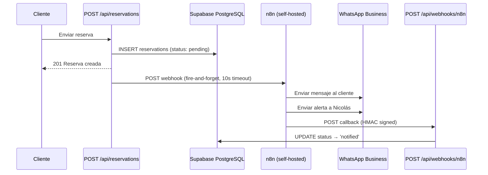

# Documentación Técnica — Parte 2: APIs, Seguridad e Integraciones

---

## 6. Referencia de API

### 6.1 APIs Públicas (apps/la-carreta, mar-y-tierra, delica)

#### `POST /api/reservations`
**Auth**: Pública (rate limited: 5 req/IP/hora)  
**Archivo**: `apps/la-carreta/src/app/api/reservations/route.ts`

| Campo | Tipo | Requerido | Descripción |
|---|---|---|---|
| restaurant_id | UUID | ✓ | ID del restaurante |
| client_name | string | ✓ | Nombre del cliente |
| whatsapp | string | ✓ | Número WhatsApp |
| date | string (YYYY-MM-DD) | ✓ | Fecha de la reserva |
| time | string (HH:MM) | ✓ | Hora de la reserva |
| guests | number (1–20) | ✓ | Comensales |
| notes | string | — | Notas opcionales |

**Flujo interno**:
1. Valida payload y restaurant_id (UUID format)
2. Verifica rate limit por IP (Map en memoria)
3. Inserta en `reservations` con status `pending` via `createReservation()`
4. Dispara webhook asíncrono a n8n (`sendReservationToN8N()`) — fire-and-forget con timeout 10s
5. Responde 201 con datos de la reserva

**Respuestas**:
- `201`: `{ data: Reservation }`
- `400`: Campos inválidos
- `429`: Rate limit excedido
- `500`: Error interno

```typescript
// Rate limit implementation (in-memory Map)
const rateLimitMap = new Map<string, { count: number; resetTime: number }>();
const RATE_LIMIT = 5;        // requests
const RATE_WINDOW = 3600000; // 1 hour in ms
```

---

#### `POST /api/analytics/events`
**Auth**: Internal token (`Authorization: Bearer <ANALYTICS_INTERNAL_TOKEN>`)  
**Archivo**: `apps/la-carreta/src/app/api/analytics/events/route.ts`

| Campo | Tipo | Requerido | Valores válidos |
|---|---|---|---|
| restaurant_id | UUID | ✓ | — |
| event_type | string | ✓ | `page_view`, `menu_view`, `menu_item_view`, `reservation_start`, `reservation_complete`, `cata_view`, `cata_book_intent`, `loyal_visitor_detected` |
| page | string | — | Path de la página |
| referrer | string | — | Referrer HTTP |

**Respuestas**: `201` éxito, `401` token inválido, `400` campos inválidos

---

#### `POST /api/webhooks/n8n`
**Auth**: HMAC-SHA256 (`x-n8n-signature` header)  
**Archivo**: `apps/la-carreta/src/app/api/webhooks/n8n/route.ts`

**Payload entrante** (desde n8n):
```typescript
interface N8NCallbackPayload {
  reservationId: string;
  whatsappSent: boolean;
  adminNotified: boolean;
  timestamp: string;
  workflow: string;
}
```

**Flujo**:
1. Lee raw body para verificación HMAC
2. Valida firma con `validateHMAC(rawBody, signature, secret)`
3. Parsea payload → actualiza reserva a `notified` o mantiene `pending`

**Verificación HMAC** (timing-safe):
```typescript
// Formato: sha256=<hex>
const expected = `sha256=${createHmac("sha256", secret).update(rawBody).digest("hex")}`;
timingSafeEqual(Buffer.from(signature), Buffer.from(expected));
```

---

#### `POST /api/revalidate`
**Auth**: Token secreto (`REVALIDATION_SECRET`)  
**Archivo**: `apps/la-carreta/src/app/api/revalidate/route.ts`

Permite al admin panel forzar revalidación ISR on-demand de rutas específicas (`/menu`, `/`).

---

### 6.2 APIs Protegidas (apps/admin)

Todas requieren sesión autenticada via cookies httpOnly + perfil en `admin_users`.

#### `PATCH /api/menu/items/[id]`
**Auth**: JWT + verificación multi-tenant  
**Archivo**: `apps/admin/src/app/api/menu/items/[id]/route.ts`

| Campo | Tipo | Descripción |
|---|---|---|
| restaurantId | UUID | ID del restaurante propietario |

**Flujo**: 
1. `getAdminProfile()` → valida sesión
2. Verifica `adminProfile.restaurants.includes(restaurantId)` → 403 si no
3. `toggleAdminMenuItem(supabase, id, restaurantId)` → invierte `is_available`
4. ISR revalidate automático en <5s

---

#### `PATCH /api/reservations/[id]`
**Auth**: JWT + verificación multi-tenant  
**Archivo**: `apps/admin/src/app/api/reservations/[id]/route.ts`

| Campo | Tipo | Valores |
|---|---|---|
| status | ReservationStatus | `pending`, `confirmed`, `cancelled`, `notified` |
| restaurantId | UUID | ID del restaurante |

**Flujo**: Misma verificación multi-tenant que menu items.

---

## 7. Autenticación y Seguridad

### 7.1 Estrategia de Autenticación

**Método principal**: Supabase Auth con Magic Link (OTP por email)  
**Método secundario**: Contraseña (password)  
**Almacenamiento**: Exclusivamente **httpOnly cookies** — NUNCA localStorage ni sessionStorage.

```
Login Flow:
  1. Usuario ingresa email en /login
  2. Si tiene password → signInWithPassword() → redirect /dashboard
  3. Si no → signInWithOtp() → email con magic link
  4. Click en link → /auth/callback?code=XXX
  5. exchangeCodeForSession() → set cookies httpOnly
  6. Redirect → /dashboard/reservas
```

### 7.2 Middleware de Sesión

**Archivo**: `apps/admin/src/utils/supabase/middleware.ts`

El middleware ejecuta en **todas las rutas** excepto assets estáticos:

```typescript
// Cookie enforcement — SIEMPRE httpOnly + Secure + SameSite=Strict
cookiesToSet.forEach(({ name, value, options }) =>
  supabaseResponse.cookies.set(name, value, {
    ...options,
    httpOnly: true,   // ← FORZADO
    secure: true,     // ← FORZADO
    sameSite: "strict" // ← FORZADO
  })
);
```

**Protección de rutas**:
- Si no hay usuario + no es ruta de auth → redirect `/login`
- Si hay usuario + está en `/login` → redirect `/dashboard/reservas`

### 7.3 Multi-Tenant Security (Defense-in-Depth)

Tres capas de protección:

| Capa | Mecanismo | Ubicación |
|---|---|---|
| **1. PostgreSQL RLS** | Políticas por tabla + rol | `schema.sql` |
| **2. Application layer** | `assertRestaurantId()` en cada query | `helpers/rls.ts` |
| **3. API layer** | `adminProfile.restaurants.includes(restaurantId)` | Cada API route |

```typescript
// Capa 2: Validación UUID — previene injection
export function assertRestaurantId(restaurantId: string | null): asserts restaurantId is string {
  if (!restaurantId || !isValidUUID(restaurantId)) {
    throw new Error(`[RLS] Invalid restaurant_id: "${restaurantId}"`);
  }
}

// Capa 3: Verificación de acceso admin
export function assertRestaurantAccess(admin: AdminUser, restaurantId: string): void {
  assertRestaurantId(restaurantId);
  if (!hasRestaurantAccess(admin, restaurantId)) {
    throw new Error(`[RLS] Admin "${admin.email}" does not have access to "${restaurantId}"`);
  }
}
```

### 7.4 Supabase Clients (Server vs Client)

| Cliente | Función | Archivo | Uso |
|---|---|---|---|
| `getPublicSupabase()` | Browser client (anon key) | `client.ts` | Lectura pública menú |
| `getServiceSupabase()` | Service role (bypasses RLS) | `client.ts` | Crear reservas |
| `getServerSupabase(cookies)` | Server SSR + JWT identity | `server.ts` | Admin: queries autenticadas |
| `getAdminSupabase()` | Service role server-only | `server.ts` | Analytics, loyal_visits, webhooks |

### 7.5 Variables de Entorno

**Validación**: `packages/database/src/env.ts` — fail-fast con mensajes claros.

| Variable | Scope | Descripción |
|---|---|---|
| `NEXT_PUBLIC_SUPABASE_URL` | Client + Server | URL del proyecto Supabase |
| `NEXT_PUBLIC_SUPABASE_ANON_KEY` | Client + Server | Clave pública (anon) |
| `SUPABASE_SERVICE_ROLE_KEY` | Server only | Clave admin (bypasses RLS) |
| `N8N_WEBHOOK_URL` | Server only | URL webhook n8n |
| `N8N_WEBHOOK_SECRET` | Server only | Secreto HMAC para validar callbacks |
| `ANALYTICS_INTERNAL_TOKEN` | Server only | Token para API de analytics |
| `REVALIDATION_SECRET` | Server only | Token para ISR on-demand |
| `ADMIN_WHATSAPP` | Server only | WhatsApp de Nicolás (E.164) |
| `EDGE_CONFIG` | Server only (opcional) | URL Vercel Edge Config (feature flags) |

---

## 8. Integración n8n (WhatsApp)

### 8.1 Flujo de Notificación de Reservas



### 8.2 Payload hacia n8n

```typescript
interface N8NReservationPayload {
  reservationId: string;
  restaurantName: string;        // "La Carreta"
  restaurantSlug: RestaurantSlug;
  clientName: string;
  clientWhatsapp: string;
  date: string;                  // Formato español: "lunes, 19 de mayo de 2026"
  time: string;
  guests: number;
  notes: string | null;
  confirmationUrl: string;       // https://lacarreta.co/reservas/{id}
  adminWhatsapp: string;         // Número de Nicolás
}
```

### 8.3 Mensaje WhatsApp (pre-construido)

```
✅ *Reserva Confirmada — La Carreta*

👤 *Nombre:* Juan Pérez
📅 *Fecha:* lunes, 19 de mayo de 2026
🕐 *Hora:* 7:00 PM
👥 *Personas:* 4
📝 *Notas:* Mesa cerca de la ventana

📍 *Dirección:* Zipaquirá, Cundinamarca

¡Te esperamos! 🍽️
```

### 8.4 Workflows n8n

| Archivo | Trigger | Acción |
|---|---|---|
| `reserva-confirmacion.json` | Webhook POST | Envía WhatsApp al cliente → callback |
| `alerta-admin.json` | Webhook POST | Envía alerta WhatsApp a Nicolás |

### 8.5 Contingencia (RSK-002)

Si n8n se desconecta:
1. Las reservas quedan en status `pending`
2. Cambiar `NOTIFICATION_PROVIDER` de `n8n` a `twilio` en Vercel
3. Redeploy → fallback a Twilio WhatsApp API
4. Ver: [contingencia-rsk-002.md](./contingencia-rsk-002.md)

---

## 9. Sistema de Fidelización Pasiva

### 9.1 Principio: Zero-PII (Zero Personal Identifiable Information)

El sistema trackea visitantes recurrentes **sin almacenar ningún dato personal**.

### 9.2 Flujo

```
1ra visita:
  → Generar UUID v4 → cookie `ns_visitor` (1 año, SameSite=Lax)
  → SHA-256(cookie_value) → guardar hash en `loyal_visits`
  → visit_count = 1

2da+ visita:
  → Leer cookie `ns_visitor` → SHA-256(value)
  → upsert_loyal_visit() → visit_count++
  → isReturning = true → UI puede adaptar contenido
```

### 9.3 Implementación: `useLoyalty` Hook

**Archivo**: `packages/ui/src/hooks/useLoyalty.ts`

- Usa Web Crypto API para SHA-256 (browser-native)
- Llama RPC `upsert_loyal_visit` via REST API de Supabase
- Captura UTM params automáticamente
- Falla silenciosamente — nunca bloquea la experiencia

---

## 10. Feature Flags (Vercel Edge Config)

**Archivo**: `packages/database/src/config/featureFlags.ts`

### Flags Disponibles

| Flag | Propósito |
|---|---|
| `reservations_enabled` | Habilitar/deshabilitar reservas por restaurante |
| `catas_enabled` | Habilitar experiencias Delica |
| `loyalty_enabled` | Habilitar tracking de fidelización |

### Resolución

```
1. Edge Config: `{restaurantId}:{flag}` (override por restaurante)
2. Edge Config: `global:{flag}` (default global)
3. Fallback: `true` (fail-open — nunca bloquea operaciones)
```

---

## 11. Analítica

### 11.1 Hook `useAnalytics`

**Archivo**: `packages/ui/src/hooks/useAnalytics.ts`

- Envía eventos a `POST /api/analytics/events` con `Authorization: Bearer <token>`
- Usa `fetch` con `keepalive: true` para entrega confiable
- Deduplica eventos rápidos (debounce 1s por event_type + page)
- Falla silenciosamente

### 11.2 Eventos Soportados

| Evento | Cuándo se dispara |
|---|---|
| `page_view` | Navegación a cualquier página |
| `menu_view` | Apertura de la carta digital |
| `menu_item_view` | Click en un plato específico |
| `reservation_start` | Inicio del formulario de reserva |
| `reservation_complete` | Reserva enviada exitosamente |
| `cata_view` | Vista de experiencia Delica |
| `cata_book_intent` | Click en reservar experiencia |
| `loyal_visitor_detected` | Visitante recurrente detectado |

---

## 12. Notificaciones Realtime (Admin)

### NotificationBell Component

**Archivo**: `apps/admin/src/app/dashboard/NotificationBell.tsx`

Usa **Supabase Realtime** (`postgres_changes`) para recibir notificaciones en vivo de nuevas reservas:

```typescript
supabase
  .channel("admin-new-reservations")
  .on("postgres_changes", {
    event: "INSERT",
    schema: "public",
    table: "reservations",
  }, (payload) => {
    // Crear notificación en UI
    const row = payload.new as ReservationPayload;
    setNotifications(prev => [notification, ...prev].slice(0, 50));
  })
  .subscribe();
```

### ReservationsClient (Realtime Updates)

**Archivo**: `apps/admin/src/app/dashboard/reservas/client.tsx`

Suscripción a todos los cambios (`INSERT`, `UPDATE`, `DELETE`) en la tabla `reservations` para actualizar la vista sin refresh.
